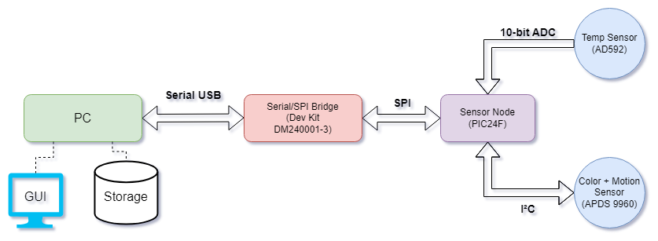

# SEP Project Description

<!-- TODO STARTS HERE -->

## Objective

The goal of this project is to design and implement a PIC24F based sensor node
that can communicate with a PC workstation, allowing for data visualization and control via a GUI.

## Requirements

The system must:
- Use PIC24F microprocessor for sensor node;
- Obtain sensor data from an analog signal (via ADC);
- Obtain data from a 2nd sensor via I²C communication;
- Connect to a PC via a Serial/SPI Bridge (also PIC24 based);
- Be controlled by a GUI running on the PC;
- Feature a timer interrupt in some capacity;
- Optimize power consumption.

## Features

The system can:
- Read the room temperature in Celsius using a AD592 sensor;
- Measure the color of an object in its vicinity using an APDS 9960 sensor;
- Identify the arrival of a new object automatically, through motion detection;
- Send sensor data between from sensor node to the PC, via the Serial/SPI Bridge;
- Evaluate if object color is within pre-determined values (PASS/FAIL);
- Stop and restart data acquisition and transmission from the GUI;
- Store timestamped sensor data on the PC in a machine readable format (i.e. csv);
- Automatically stop data acquisition and transmission, if no new objects arrive after some time;
- Display on the GUI:
  - *#* of objects detected;
  - Color of current object (color name and RGB value);
  - Color of current object (square with color according to RGB value);
  - Color PASS or FAIL;
  - Room Temperature;
  - Current time;
  - Last new object arrival time;
  - Time Elapsed since last new object;
  - Option to Stop/Start data acquisition;
  - Option to save data on PC.
- (...)
  
  **TODO: ADD GUI EXAMPLE**

## High Level Architecture:

The following architecture is to be implemented for this project:

## Workflow:

**TODO: ADD WORKFLOW DIAGRAM**

## Components Used (Bill of Materials?):

- PIC24F(...) micro controller
- PIC24F Dev board
- Resistors (...)
- Capacitors (...)
- LED (...)
- Breadboard (...)
- Temp Sensor
- Color + Motion sensor
- PC
- (...)

## Schematics:

**TODO: ADD SENSOR NODE SCHEMATIC**
