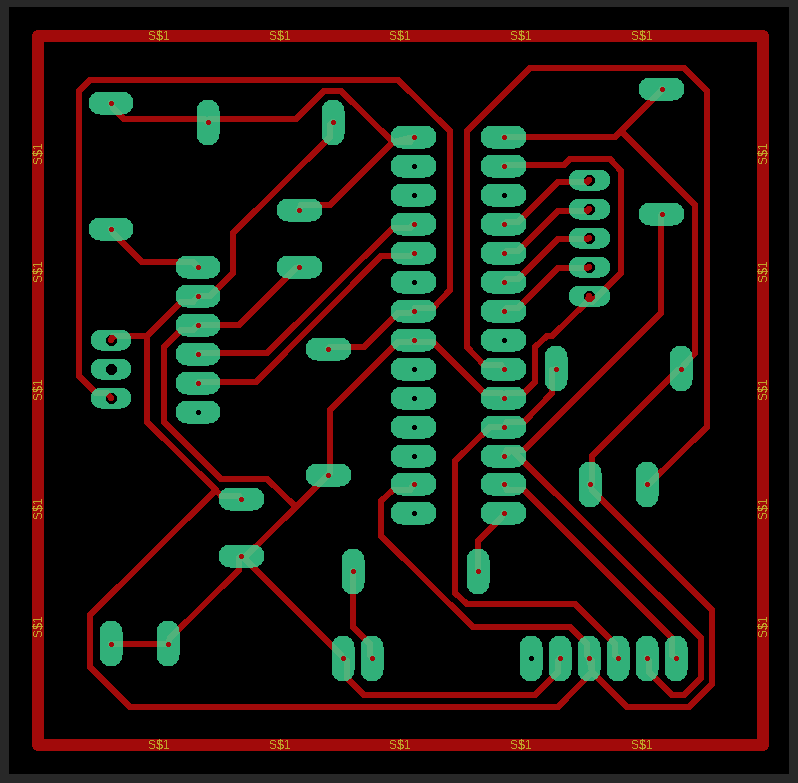

# SEP Project Description

<!-- TODO STARTS HERE -->

## Objective

The goal of this project is to design and implement a PIC24F based sensor node
that can communicate with a PC workstation, allowing for data visualization and control via a GUI.

## Requirements

The system must:

- Use PIC24F microprocessor for sensor node;
- Obtain sensor data from an analog signal (via ADC);
- Obtain data from a 2nd sensor via I²C communication;
- Connect to a PC via a Serial/SPI Bridge (also PIC24 based);
- Be controlled by a GUI running on the PC;
- Feature interrupt mechanisms in some capacity, avoiding blocking functions;
- Optimize power consumption.

## Features

The system can:

- Read the ambient temperature using a AD592 sensor;
- Measure ambient light using an APDS 9960 sensor;
- Measure the proximity and color of an object in its vicinity, also with APDS 9960;
- ~~Identify the arrival of a new object automatically, through motion detection;~~
- Send sensor data from sensor node to the PC, via the Serial/SPI Bridge;
- ~~Evaluate if object color is within pre-determined values (PASS/FAIL);~~
- Stop and restart data acquisition and transmission from the GUI;
- Store timestamped sensor data on the PC in a machine readable format (i.e. csv);
- ~~Automatically stop data acquisition and transmission, if no new objects arrive after some time;~~
- Display on the GUI:

  - ~~*#* of objects detected;~~
  - Color of current object (color name and RGB value);
  - Color of current object (square with color according to RGB value);
  - ~~Color PASS or FAIL;~~
  - Room Temperature;
  - Current time;
  - ~~Last new object arrival time;~~
  - ~~Time Elapsed since last new object;~~
  - Option to Stop/Start data acquisition;
  - Option to save data on PC.

## GUI Example

## High Level Architecture:

The following architecture is to be implemented for this project:

## Workflow:

## Sensor Node Schematic and Layout:

## Sensor Node Bill of Materials:

| Part         | Value           | Device          | Package     | Description  |
|--------------|-----------------|-----------------|-------------|--------------|
| C1           | C               | C               | CAP         | Capacitor    |
| C2           | C               | C               | CAP         | Capacitor    |
| C3           | C               | C               | CAP         | Capacitor    |
| C4           | C               | C               | CAP         | Capacitor    |
| D1           | LED             | LED             | LED         | LED          |
| J1           | H1X6            | H1X6            | H1X6        | Header       |
| J2           | H1X6            | H1X6            | H1X6        | Header       |
| JP1          | 100             | PINHD-1X3       | 1X03        | PIN HEADER   |
| JP2          | 100             | PINHD-1X5       | 1X05        | PIN HEADER   |
| PIC24FJ256GA1| PIC24FJ256GA702 | PIC24FJ256GA702 | PIC24       | PIC24FJ256GA702 |
| R1           | 470             | R               | RES         | Resistance   |
| R2           | 100             | R               | RES         | Resistance   |
| R3           | 10000           | R               | RES         | Resistance   |
| R4           | 2200            | R               | RES         | Resistance   |
| R5           | 2200            | R               | RES         | Resistance   |
| R6           | 1000            | R               | RES         | Resistance   |

  
##Presentation Slides

